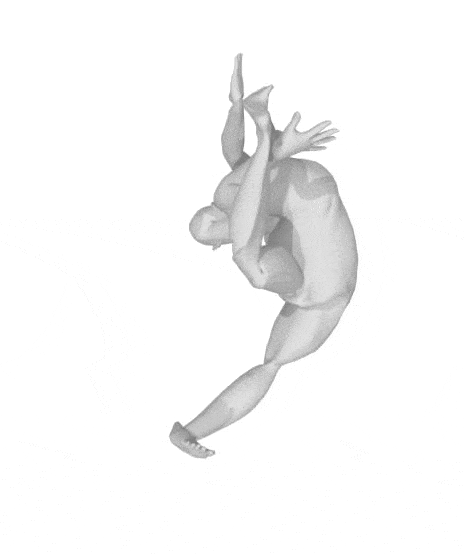
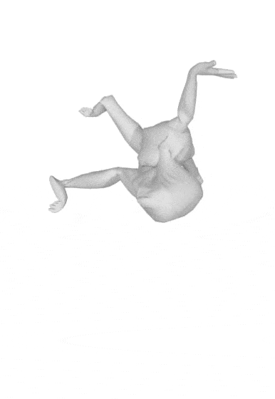
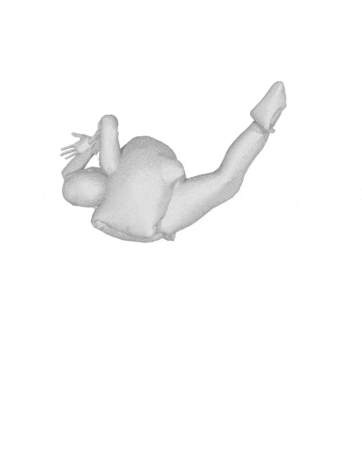

    <h1>HumanPoseGenerator</h1>
    <!-- 
Generate realistic human poses using manifold-aware conditional flow matching.
 -->
    

        <a href="#introduction">introduction</a>
        ∙
        <a href="#installation">getting started</a>
        ∙
        <a href="#demo">demonstration</a>
    

    
    
    

    <h2>Introduction</h2>
    <h3>What is it</h3>
    

        HumanPoseGenerator is a generative model that belong to the conditional flow matching models family.
        As the name suggests, the model generates realistic human poses.
    

    <h3>How it works</h3>
    

        A human pose can be parameterized using the rotation of every joint in the human body.
        Out of all possible set of rotations, only some produce realistic human poses while the rest produce poses with unnaturally twisted limbs and necks.
    

    

        HumanPoseGenerator is trained to transform any set of rotations to a set of rotations that produce a realistic human pose.
        Therefore, one can generate realistic human poses in two steps:
    

    <ol>
        <li>Randomly generate a set of rotations</li>
        <li>Transform the set of rotations using HumanPoseGenerator</li>
    </ol>
    

        The transformation process is visualized by the gifs at the top of this page.
    

    <h2>Getting Started</h2>
    <h3>Dependencies</h3>
    

        In order to use the code, you need the following:
    

    <ul>
        <li>CUDA-capable GPU(s)</li>
        <li>[optional] <a href="https://anaconda.org/anaconda/conda">conda</a></li>
        <li>[optional] <a href="https://www.gnu.org/software/make/">Make</a></li>
    </ul>
    <h3>Obtaining the code and installing environment</h3>
    

        First, clone the repository to your machine using <a href="https://git-scm.com">Git</a>:
    

    <pre><code class="language-bash"><!--
    -->git clone https://github.com/rezhaTanuharja/HumanPoseGenerator.git<!--
    --></code></pre>
    

        By default, this clone the code into a directory with the name <code>HumanPoseGenerator</code>.
        If you have Make, you can navigate into the directory and run
    

    <pre><code class="language-bash"><!--
    -->make all<!--
    --></code></pre>
    

        This will automatically create a conda environment and install all required Python packages inside the environment.
        If you don't use Make, you can create the environment by following the steps inside <code>Makefile</code>.
        Subsequently, execute
    

    <pre><code class="language-bash"><!--
    -->conda activate pose_generator<!--
    --></code></pre>
    

        to activate the conda environment.
        This is the default environment name created using the <code>Makefile</code>.
    

    <h2>Demonstration</h2>
    

        Coming soon!
    

